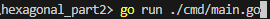
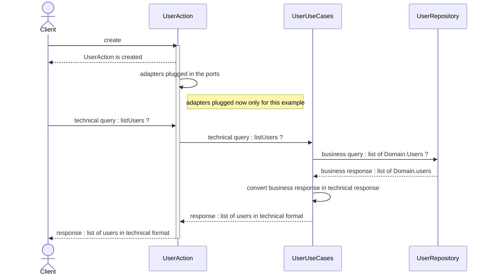

# hexagonal example

# run
- under the ../hexagonal_part2 directory write the following command  go run ./cmd/main.go

- response :

- explanation

```mermaid
sequenceDiagram
actor Client
participant UserAction
participant UserUseCases
participant UserRepository

Client ->>UserAction : create
activate UserAction
UserAction -->>Client: UserAction is created
UserAction ->>UserAction : adapters plugged in the ports
Note right of UserAction : adapters plugged now only for this example
Client ->>UserAction : technical query : listUsers ?
UserAction ->>UserUseCases : technical query : listUsers ?
UserUseCases  ->>UserRepository : business query : list of Domain.Users ?
UserRepository -->>UserUseCases : business response : list of Domain.users
UserUseCases ->>UserUseCases : convert business response in technical response
UserUseCases -->>UserAction : response : list of users in technical format
UserAction -->>Client : response : list of users in technical format
deactivate UserAction

```