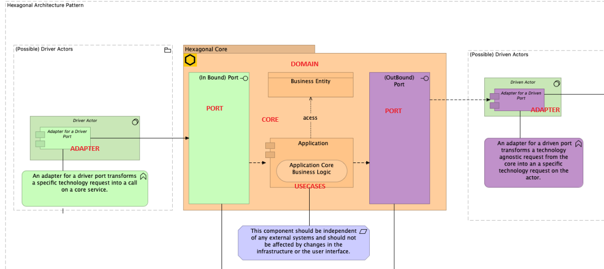
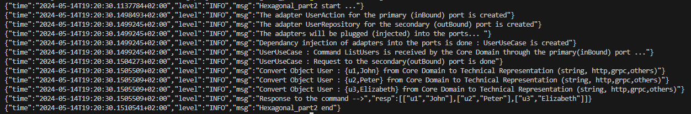
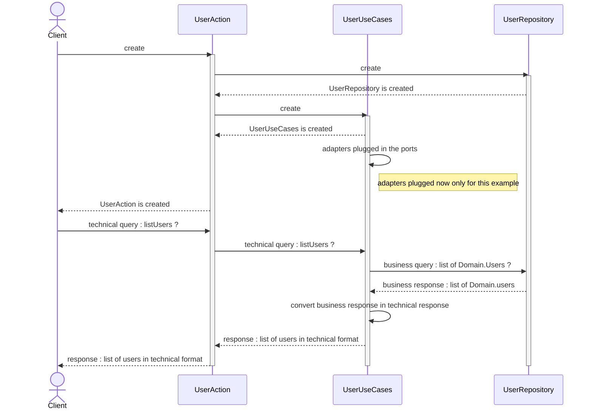

# hexagonal example

# run
- Under the ../hexagonal_part2 directory write the following command  go run ./cmd/main.go

- Response :

- Explanation

```mermaid
sequenceDiagram
actor Client
participant UserAction
participant UserUseCases
participant UserRepository

Client ->>UserAction : create
activate UserAction
UserAction ->>UserRepository : create
activate UserRepository
UserRepository -->>UserAction : UserRepository is created
UserAction ->>UserUseCases : create
activate UserUseCases
UserUseCases -->>UserAction : UserUseCases is created
UserUseCases ->>UserUseCases : adapters plugged in the ports
Note right of UserUseCases : adapters plugged now only for this example
UserAction -->>Client: UserAction is created
Client ->>UserAction : technical query : listUsers ?
UserAction ->>UserUseCases : technical query : listUsers ?
UserUseCases  ->>UserRepository : business query : list of Domain.Users ?
UserRepository -->>UserUseCases : business response : list of Domain.users
UserUseCases ->>UserUseCases : convert business response in technical response
UserUseCases -->>UserAction : response : list of users in technical format
UserAction -->>Client : response : list of users in technical format
deactivate UserAction
deactivate UserRepository
deactivate UserUseCases

```